


>Chimpanzee prosociality experiment, as seen from the perspective of the focal animal. The left and right levers are indicated in the foreground. Pulling either expands an accordion device in the center, pushing the food trays towards both ends of the table. Both food trays close to the focal animal have food in them. Only one of the food trays on the other side contains food. The partner condition means another animal, as pictured, sits on the other end of the table. Otherwise, the other end was empty. (McElreath 293)


## Seeing the Data


```python
%matplotlib inline
import numpy as np
import scipy as sp
import matplotlib as mpl
import matplotlib.cm as cm
import matplotlib.pyplot as plt
import pandas as pd
pd.set_option('display.width', 500)
pd.set_option('display.max_columns', 100)
pd.set_option('display.notebook_repr_html', True)
import seaborn as sns
sns.set_style("whitegrid")
sns.set_context("poster")
import pymc3 as pm
```


```python
df=pd.read_csv("data/chimpanzees2.csv", sep=";")
df.head()
```


<div>
<table border="1" class="dataframe">
  <thead>
    <tr style="text-align: right;">
      <th></th>
      <th>actor</th>
      <th>recipient</th>
      <th>condition</th>
      <th>block</th>
      <th>trial</th>
      <th>prosoc_left</th>
      <th>chose_prosoc</th>
      <th>pulled_left</th>
    </tr>
  </thead>
  <tbody>
    <tr>
      <th>0</th>
      <td>1</td>
      <td>0</td>
      <td>0</td>
      <td>1</td>
      <td>2</td>
      <td>0</td>
      <td>1</td>
      <td>0</td>
    </tr>
    <tr>
      <th>1</th>
      <td>1</td>
      <td>0</td>
      <td>0</td>
      <td>1</td>
      <td>4</td>
      <td>0</td>
      <td>0</td>
      <td>1</td>
    </tr>
    <tr>
      <th>2</th>
      <td>1</td>
      <td>0</td>
      <td>0</td>
      <td>1</td>
      <td>6</td>
      <td>1</td>
      <td>0</td>
      <td>0</td>
    </tr>
    <tr>
      <th>3</th>
      <td>1</td>
      <td>0</td>
      <td>0</td>
      <td>1</td>
      <td>8</td>
      <td>0</td>
      <td>1</td>
      <td>0</td>
    </tr>
    <tr>
      <th>4</th>
      <td>1</td>
      <td>0</td>
      <td>0</td>
      <td>1</td>
      <td>10</td>
      <td>1</td>
      <td>1</td>
      <td>1</td>
    </tr>
  </tbody>
</table>
</div>


```python
df.head(100)
```


<div>
<table border="1" class="dataframe">
  <thead>
    <tr style="text-align: right;">
      <th></th>
      <th>actor</th>
      <th>recipient</th>
      <th>condition</th>
      <th>block</th>
      <th>trial</th>
      <th>prosoc_left</th>
      <th>chose_prosoc</th>
      <th>pulled_left</th>
    </tr>
  </thead>
  <tbody>
    <tr>
      <th>0</th>
      <td>1</td>
      <td>0</td>
      <td>0</td>
      <td>1</td>
      <td>2</td>
      <td>0</td>
      <td>1</td>
      <td>0</td>
    </tr>
    <tr>
      <th>1</th>
      <td>1</td>
      <td>0</td>
      <td>0</td>
      <td>1</td>
      <td>4</td>
      <td>0</td>
      <td>0</td>
      <td>1</td>
    </tr>
    <tr>
      <th>2</th>
      <td>1</td>
      <td>0</td>
      <td>0</td>
      <td>1</td>
      <td>6</td>
      <td>1</td>
      <td>0</td>
      <td>0</td>
    </tr>
    <tr>
      <th>3</th>
      <td>1</td>
      <td>0</td>
      <td>0</td>
      <td>1</td>
      <td>8</td>
      <td>0</td>
      <td>1</td>
      <td>0</td>
    </tr>
    <tr>
      <th>4</th>
      <td>1</td>
      <td>0</td>
      <td>0</td>
      <td>1</td>
      <td>10</td>
      <td>1</td>
      <td>1</td>
      <td>1</td>
    </tr>
    <tr>
      <th>5</th>
      <td>1</td>
      <td>0</td>
      <td>0</td>
      <td>1</td>
      <td>12</td>
      <td>1</td>
      <td>1</td>
      <td>1</td>
    </tr>
    <tr>
      <th>6</th>
      <td>1</td>
      <td>0</td>
      <td>0</td>
      <td>2</td>
      <td>14</td>
      <td>1</td>
      <td>0</td>
      <td>0</td>
    </tr>
    <tr>
      <th>7</th>
      <td>1</td>
      <td>0</td>
      <td>0</td>
      <td>2</td>
      <td>16</td>
      <td>1</td>
      <td>0</td>
      <td>0</td>
    </tr>
    <tr>
      <th>8</th>
      <td>1</td>
      <td>0</td>
      <td>0</td>
      <td>2</td>
      <td>18</td>
      <td>0</td>
      <td>1</td>
      <td>0</td>
    </tr>
    <tr>
      <th>9</th>
      <td>1</td>
      <td>0</td>
      <td>0</td>
      <td>2</td>
      <td>20</td>
      <td>0</td>
      <td>1</td>
      <td>0</td>
    </tr>
    <tr>
      <th>10</th>
      <td>1</td>
      <td>0</td>
      <td>0</td>
      <td>2</td>
      <td>22</td>
      <td>0</td>
      <td>0</td>
      <td>1</td>
    </tr>
    <tr>
      <th>11</th>
      <td>1</td>
      <td>0</td>
      <td>0</td>
      <td>2</td>
      <td>24</td>
      <td>1</td>
      <td>0</td>
      <td>0</td>
    </tr>
    <tr>
      <th>12</th>
      <td>1</td>
      <td>0</td>
      <td>0</td>
      <td>3</td>
      <td>26</td>
      <td>0</td>
      <td>0</td>
      <td>1</td>
    </tr>
    <tr>
      <th>13</th>
      <td>1</td>
      <td>0</td>
      <td>0</td>
      <td>3</td>
      <td>28</td>
      <td>1</td>
      <td>1</td>
      <td>1</td>
    </tr>
    <tr>
      <th>14</th>
      <td>1</td>
      <td>0</td>
      <td>0</td>
      <td>3</td>
      <td>30</td>
      <td>0</td>
      <td>1</td>
      <td>0</td>
    </tr>
    <tr>
      <th>15</th>
      <td>1</td>
      <td>0</td>
      <td>0</td>
      <td>3</td>
      <td>32</td>
      <td>1</td>
      <td>1</td>
      <td>1</td>
    </tr>
    <tr>
      <th>16</th>
      <td>1</td>
      <td>0</td>
      <td>0</td>
      <td>3</td>
      <td>34</td>
      <td>1</td>
      <td>0</td>
      <td>0</td>
    </tr>
    <tr>
      <th>17</th>
      <td>1</td>
      <td>0</td>
      <td>0</td>
      <td>3</td>
      <td>36</td>
      <td>0</td>
      <td>1</td>
      <td>0</td>
    </tr>
    <tr>
      <th>18</th>
      <td>1</td>
      <td>0</td>
      <td>0</td>
      <td>4</td>
      <td>38</td>
      <td>1</td>
      <td>1</td>
      <td>1</td>
    </tr>
    <tr>
      <th>19</th>
      <td>1</td>
      <td>0</td>
      <td>0</td>
      <td>4</td>
      <td>40</td>
      <td>0</td>
      <td>0</td>
      <td>1</td>
    </tr>
    <tr>
      <th>20</th>
      <td>1</td>
      <td>0</td>
      <td>0</td>
      <td>4</td>
      <td>42</td>
      <td>0</td>
      <td>0</td>
      <td>1</td>
    </tr>
    <tr>
      <th>21</th>
      <td>1</td>
      <td>0</td>
      <td>0</td>
      <td>4</td>
      <td>44</td>
      <td>0</td>
      <td>1</td>
      <td>0</td>
    </tr>
    <tr>
      <th>22</th>
      <td>1</td>
      <td>0</td>
      <td>0</td>
      <td>4</td>
      <td>46</td>
      <td>1</td>
      <td>1</td>
      <td>1</td>
    </tr>
    <tr>
      <th>23</th>
      <td>1</td>
      <td>0</td>
      <td>0</td>
      <td>4</td>
      <td>48</td>
      <td>1</td>
      <td>0</td>
      <td>0</td>
    </tr>
    <tr>
      <th>24</th>
      <td>1</td>
      <td>0</td>
      <td>0</td>
      <td>5</td>
      <td>50</td>
      <td>0</td>
      <td>1</td>
      <td>0</td>
    </tr>
    <tr>
      <th>25</th>
      <td>1</td>
      <td>0</td>
      <td>0</td>
      <td>5</td>
      <td>52</td>
      <td>0</td>
      <td>0</td>
      <td>1</td>
    </tr>
    <tr>
      <th>26</th>
      <td>1</td>
      <td>0</td>
      <td>0</td>
      <td>5</td>
      <td>54</td>
      <td>1</td>
      <td>0</td>
      <td>0</td>
    </tr>
    <tr>
      <th>27</th>
      <td>1</td>
      <td>0</td>
      <td>0</td>
      <td>5</td>
      <td>56</td>
      <td>1</td>
      <td>0</td>
      <td>0</td>
    </tr>
    <tr>
      <th>28</th>
      <td>1</td>
      <td>0</td>
      <td>0</td>
      <td>5</td>
      <td>58</td>
      <td>0</td>
      <td>1</td>
      <td>0</td>
    </tr>
    <tr>
      <th>29</th>
      <td>1</td>
      <td>0</td>
      <td>0</td>
      <td>5</td>
      <td>60</td>
      <td>1</td>
      <td>0</td>
      <td>0</td>
    </tr>
    <tr>
      <th>...</th>
      <td>...</td>
      <td>...</td>
      <td>...</td>
      <td>...</td>
      <td>...</td>
      <td>...</td>
      <td>...</td>
      <td>...</td>
    </tr>
    <tr>
      <th>70</th>
      <td>1</td>
      <td>8</td>
      <td>1</td>
      <td>6</td>
      <td>69</td>
      <td>1</td>
      <td>1</td>
      <td>1</td>
    </tr>
    <tr>
      <th>71</th>
      <td>1</td>
      <td>4</td>
      <td>1</td>
      <td>6</td>
      <td>71</td>
      <td>0</td>
      <td>1</td>
      <td>0</td>
    </tr>
    <tr>
      <th>72</th>
      <td>2</td>
      <td>0</td>
      <td>0</td>
      <td>1</td>
      <td>1</td>
      <td>1</td>
      <td>1</td>
      <td>1</td>
    </tr>
    <tr>
      <th>73</th>
      <td>2</td>
      <td>0</td>
      <td>0</td>
      <td>1</td>
      <td>3</td>
      <td>0</td>
      <td>0</td>
      <td>1</td>
    </tr>
    <tr>
      <th>74</th>
      <td>2</td>
      <td>0</td>
      <td>0</td>
      <td>1</td>
      <td>5</td>
      <td>0</td>
      <td>0</td>
      <td>1</td>
    </tr>
    <tr>
      <th>75</th>
      <td>2</td>
      <td>0</td>
      <td>0</td>
      <td>1</td>
      <td>7</td>
      <td>0</td>
      <td>0</td>
      <td>1</td>
    </tr>
    <tr>
      <th>76</th>
      <td>2</td>
      <td>0</td>
      <td>0</td>
      <td>1</td>
      <td>9</td>
      <td>1</td>
      <td>1</td>
      <td>1</td>
    </tr>
    <tr>
      <th>77</th>
      <td>2</td>
      <td>0</td>
      <td>0</td>
      <td>1</td>
      <td>11</td>
      <td>1</td>
      <td>1</td>
      <td>1</td>
    </tr>
    <tr>
      <th>78</th>
      <td>2</td>
      <td>0</td>
      <td>0</td>
      <td>2</td>
      <td>13</td>
      <td>1</td>
      <td>1</td>
      <td>1</td>
    </tr>
    <tr>
      <th>79</th>
      <td>2</td>
      <td>0</td>
      <td>0</td>
      <td>2</td>
      <td>15</td>
      <td>1</td>
      <td>1</td>
      <td>1</td>
    </tr>
    <tr>
      <th>80</th>
      <td>2</td>
      <td>0</td>
      <td>0</td>
      <td>2</td>
      <td>17</td>
      <td>1</td>
      <td>1</td>
      <td>1</td>
    </tr>
    <tr>
      <th>81</th>
      <td>2</td>
      <td>0</td>
      <td>0</td>
      <td>2</td>
      <td>19</td>
      <td>0</td>
      <td>0</td>
      <td>1</td>
    </tr>
    <tr>
      <th>82</th>
      <td>2</td>
      <td>0</td>
      <td>0</td>
      <td>2</td>
      <td>21</td>
      <td>0</td>
      <td>0</td>
      <td>1</td>
    </tr>
    <tr>
      <th>83</th>
      <td>2</td>
      <td>0</td>
      <td>0</td>
      <td>2</td>
      <td>23</td>
      <td>0</td>
      <td>0</td>
      <td>1</td>
    </tr>
    <tr>
      <th>84</th>
      <td>2</td>
      <td>0</td>
      <td>0</td>
      <td>3</td>
      <td>25</td>
      <td>0</td>
      <td>0</td>
      <td>1</td>
    </tr>
    <tr>
      <th>85</th>
      <td>2</td>
      <td>0</td>
      <td>0</td>
      <td>3</td>
      <td>27</td>
      <td>0</td>
      <td>0</td>
      <td>1</td>
    </tr>
    <tr>
      <th>86</th>
      <td>2</td>
      <td>0</td>
      <td>0</td>
      <td>3</td>
      <td>29</td>
      <td>1</td>
      <td>1</td>
      <td>1</td>
    </tr>
    <tr>
      <th>87</th>
      <td>2</td>
      <td>0</td>
      <td>0</td>
      <td>3</td>
      <td>31</td>
      <td>1</td>
      <td>1</td>
      <td>1</td>
    </tr>
    <tr>
      <th>88</th>
      <td>2</td>
      <td>0</td>
      <td>0</td>
      <td>3</td>
      <td>33</td>
      <td>0</td>
      <td>0</td>
      <td>1</td>
    </tr>
    <tr>
      <th>89</th>
      <td>2</td>
      <td>0</td>
      <td>0</td>
      <td>3</td>
      <td>35</td>
      <td>1</td>
      <td>1</td>
      <td>1</td>
    </tr>
    <tr>
      <th>90</th>
      <td>2</td>
      <td>0</td>
      <td>0</td>
      <td>4</td>
      <td>37</td>
      <td>0</td>
      <td>0</td>
      <td>1</td>
    </tr>
    <tr>
      <th>91</th>
      <td>2</td>
      <td>0</td>
      <td>0</td>
      <td>4</td>
      <td>39</td>
      <td>0</td>
      <td>0</td>
      <td>1</td>
    </tr>
    <tr>
      <th>92</th>
      <td>2</td>
      <td>0</td>
      <td>0</td>
      <td>4</td>
      <td>41</td>
      <td>1</td>
      <td>1</td>
      <td>1</td>
    </tr>
    <tr>
      <th>93</th>
      <td>2</td>
      <td>0</td>
      <td>0</td>
      <td>4</td>
      <td>43</td>
      <td>0</td>
      <td>0</td>
      <td>1</td>
    </tr>
    <tr>
      <th>94</th>
      <td>2</td>
      <td>0</td>
      <td>0</td>
      <td>4</td>
      <td>45</td>
      <td>1</td>
      <td>1</td>
      <td>1</td>
    </tr>
    <tr>
      <th>95</th>
      <td>2</td>
      <td>0</td>
      <td>0</td>
      <td>4</td>
      <td>47</td>
      <td>1</td>
      <td>1</td>
      <td>1</td>
    </tr>
    <tr>
      <th>96</th>
      <td>2</td>
      <td>0</td>
      <td>0</td>
      <td>5</td>
      <td>49</td>
      <td>0</td>
      <td>0</td>
      <td>1</td>
    </tr>
    <tr>
      <th>97</th>
      <td>2</td>
      <td>0</td>
      <td>0</td>
      <td>5</td>
      <td>51</td>
      <td>1</td>
      <td>1</td>
      <td>1</td>
    </tr>
    <tr>
      <th>98</th>
      <td>2</td>
      <td>0</td>
      <td>0</td>
      <td>5</td>
      <td>53</td>
      <td>0</td>
      <td>0</td>
      <td>1</td>
    </tr>
    <tr>
      <th>99</th>
      <td>2</td>
      <td>0</td>
      <td>0</td>
      <td>5</td>
      <td>55</td>
      <td>1</td>
      <td>1</td>
      <td>1</td>
    </tr>
  </tbody>
</table>
<p>100 rows × 8 columns</p>
</div>


>We're going to focus on `pulled_left` as the outcome to predict, with `prosoc_left` and `condition` as predictor variables. The outcome `pulled_left` is a 0 or 1 indicator that the focal animal pulled the left-hand lever. The predictor `prosoc_left` is a 0/1 indicator that the left-hand lever was (1) or was not (0) attached to the prosocial option, the side with two pieces of food. The `condition` predictor is another 0/1 indicator, with value 1 for the partner condition and value 0 for the control condition. (McElreath 293)


```python
df.shape
```


    (504, 8)


```python
gd={}
for k, v in df.groupby('actor'):
    temp = v.groupby(['condition', 'prosoc_left'])['pulled_left'].mean()
    gd[k] = temp.values
    #print(k, ldf.values)
```


```python
gd
```


    {1: array([ 0.33333333,  0.5       ,  0.27777778,  0.55555556]),
     2: array([1, 1, 1, 1]),
     3: array([ 0.27777778,  0.61111111,  0.16666667,  0.33333333]),
     4: array([ 0.33333333,  0.5       ,  0.11111111,  0.44444444]),
     5: array([ 0.33333333,  0.55555556,  0.27777778,  0.5       ]),
     6: array([ 0.77777778,  0.61111111,  0.55555556,  0.61111111]),
     7: array([ 0.77777778,  0.83333333,  0.94444444,  1.        ])}


## 3 different models


```python
def full_model():
    with pm.Model() as ps1:
        betapc = pm.Normal("betapc", 0, 10)
        betap = pm.Normal("betap", 0, 10)
        alpha = pm.Normal('alpha', 0, 10)
        logitpi = alpha + (betap + betapc*df.condition)*df.prosoc_left
        o = pm.Bernoulli("pulled_left", p=pm.math.invlogit(logitpi), observed=df.pulled_left)
        
    return ps1
```


```python
def ionly_model():
    with pm.Model() as ps0:
        alpha = pm.Normal('alpha', 0, 10)
        logitpi = alpha 
        o = pm.Bernoulli("pulled_left", p=pm.math.invlogit(logitpi), observed=df.pulled_left)
    return ps0
```


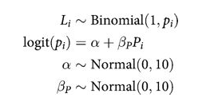


```python
def plonly_model():
    with pm.Model() as plonly:
        betap = pm.Normal("betap", 0, 10)
        alpha = pm.Normal('alpha', 0, 10)
        logitpi = alpha + betap*df.prosoc_left
        o = pm.Bernoulli("pulled_left", p=pm.math.invlogit(logitpi), observed=df.pulled_left)
    return plonly
```


```python
ionly = ionly_model()
with ionly:
    trace_ionly=pm.sample(2000)
```


      6%|▌         | 11049/200000 [00:01<00:17, 10555.47it/s]| 1208/200000 [00:00<00:16, 12074.31it/s]
    100%|██████████| 2000/2000 [00:01<00:00, 1294.47it/s]


```python
pm.autocorrplot(trace_ionly)
```


    array([[<matplotlib.axes._subplots.AxesSubplot object at 0x11d99d0b8>]], dtype=object)


```python
def invlogit(x):
    return np.exp(x) / (1 + np.exp(x))
```


```python
plt.hist(invlogit(trace_ionly['alpha']), bins=50);
```


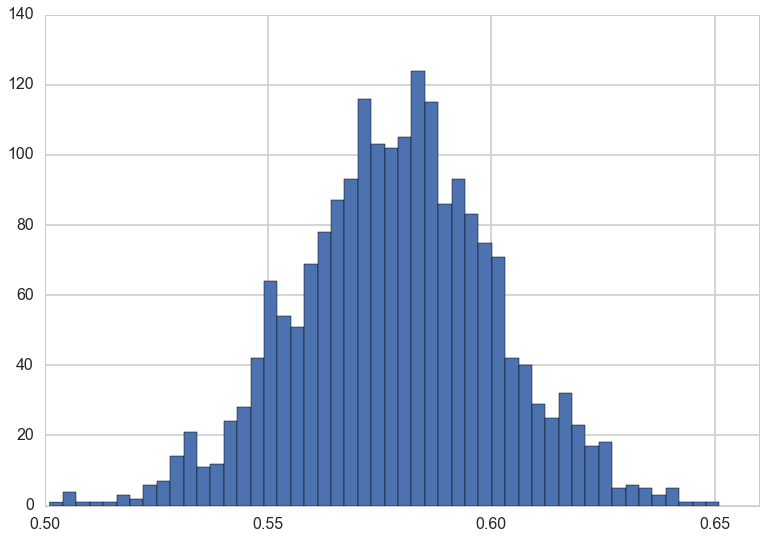


```python
pm.quantiles(invlogit(trace_ionly['alpha'])), np.mean(invlogit(trace_ionly['alpha']))
```


    ({2.5: 0.53243255337858819,
      25: 0.5644365978988698,
      50: 0.57934469075699768,
      75: 0.59336332316257956,
      97.5: 0.6230968437257266},
     0.5787415405818559)


```python
full = full_model()
with full:
    trace_full=pm.sample(2000)
```


     10%|▉         | 19518/200000 [00:04<00:56, 3177.49it/s] | 568/200000 [00:00<00:35, 5675.74it/s]
    100%|██████████| 2000/2000 [00:04<00:00, 436.93it/s]


```python
plonly = plonly_model()
with plonly:
    trace_plonly=pm.sample(2000)
```


      0%|          | 0/200000 [00:00<?, ?it/s]  0%|          | 546/200000 [00:00<00:36, 5459.61it/s]
    100%|██████████| 2000/2000 [00:02<00:00, 704.87it/s]


## Model Comparison


```python
def make_compare(names, traces, models, ic='WAIC'):
    comparedf=pm.compare(traces,models)
    temp=comparedf.sort_index()
    temp['Model']=names
    comparedf = temp.sort(ic).set_index('Model')
    return comparedf
```


```python
names=['intercept only', 'full', 'prosocial left only']
dfc=make_compare(names, [trace_ionly, trace_full, trace_plonly],[ionly, full, plonly])
dfc
```


    //anaconda/envs/py35/lib/python3.5/site-packages/ipykernel/__main__.py:5: FutureWarning: sort(columns=....) is deprecated, use sort_values(by=.....)


<div>
<table border="1" class="dataframe">
  <thead>
    <tr style="text-align: right;">
      <th></th>
      <th>WAIC</th>
      <th>pWAIC</th>
      <th>dWAIC</th>
      <th>weight</th>
      <th>SE</th>
      <th>dSE</th>
      <th>warning</th>
    </tr>
    <tr>
      <th>Model</th>
      <th></th>
      <th></th>
      <th></th>
      <th></th>
      <th></th>
      <th></th>
      <th></th>
    </tr>
  </thead>
  <tbody>
    <tr>
      <th>prosocial left only</th>
      <td>680.791</td>
      <td>2.14711</td>
      <td>0</td>
      <td>0.684034</td>
      <td>9.35413</td>
      <td>0</td>
      <td>0</td>
    </tr>
    <tr>
      <th>full</th>
      <td>682.456</td>
      <td>3.05751</td>
      <td>1.66475</td>
      <td>0.297566</td>
      <td>9.41019</td>
      <td>0.0250039</td>
      <td>0</td>
    </tr>
    <tr>
      <th>intercept only</th>
      <td>688.022</td>
      <td>1.04066</td>
      <td>7.23134</td>
      <td>0.0183998</td>
      <td>7.06937</td>
      <td>1.72363</td>
      <td>0</td>
    </tr>
  </tbody>
</table>
</div>


```python
def compare_plot(comp_df, ax=None):
    """
    Model comparison summary plot in the style of the one used in the book
    Statistical Rethinking by Richard McElreath.
    Parameters
    ----------
    comp_df: DataFrame
        The result of the pm.compare() function
    ax : axes
        Matplotlib axes. Defaults to None.
    Returns
    -------
    ax : matplotlib axes
    """
    if ax is None:
        _, ax = plt.subplots()

    yticks_pos, step = np.linspace(0, -1, (comp_df.shape[0] * 2) - 1, retstep=True)
    yticks_pos[1::2] = yticks_pos[1::2] + step / 2

    yticks_labels = [''] * len(yticks_pos)
    yticks_labels[0] = comp_df.index[0]
    yticks_labels[1::2] = comp_df.index[1:]

    data = comp_df.values
    min_ic = data[0, 0]

    ax.errorbar(x=data[:, 0], y=yticks_pos[::2], xerr=data[:, 4],
                fmt='ko', mfc='None', mew=1)
    ax.errorbar(x=data[1:, 0], y=yticks_pos[1::2],
                xerr=data[1:, 5], fmt='^', color='grey')

    ax.plot(data[:, 0] - (2 * data[:, 1]), yticks_pos[::2], 'ko')
    ax.axvline(min_ic, ls='--', color='grey')

    ax.set_yticks(yticks_pos)
    ax.set_yticklabels(yticks_labels)
    ax.set_xlabel('Deviance')
    lims=ax.get_ylim()
    ax.set_ylim(lims[0] + step/2., lims[1] - step/2.)
    return ax
```


```python
compare_plot(dfc)
```


    <matplotlib.axes._subplots.AxesSubplot at 0x120e25e80>


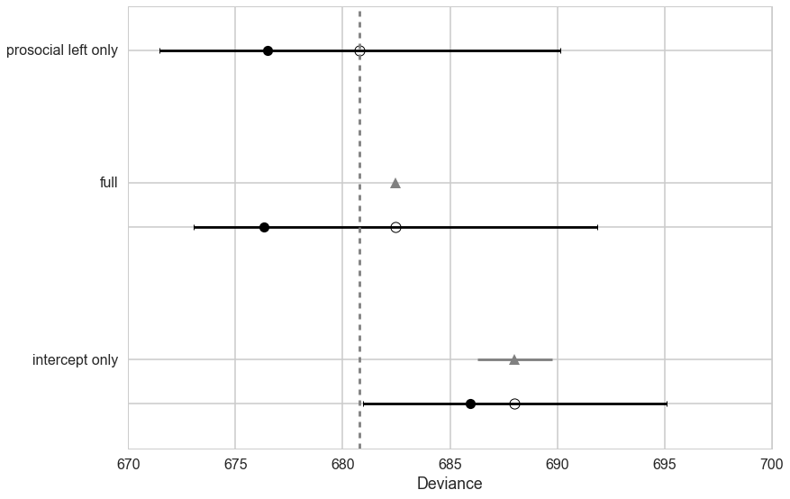


```python
pm.summary(trace_full)
```


    
    betapc:
    
      Mean             SD               MC Error         95% HPD interval
      -------------------------------------------------------------------
      
      -0.097           0.266            0.008            [-0.598, 0.427]
    
      Posterior quantiles:
      2.5            25             50             75             97.5
      |--------------|==============|==============|--------------|
      
      -0.608         -0.275         -0.098         0.079          0.420
    
    
    betap:
    
      Mean             SD               MC Error         95% HPD interval
      -------------------------------------------------------------------
      
      0.610            0.232            0.007            [0.151, 1.067]
    
      Posterior quantiles:
      2.5            25             50             75             97.5
      |--------------|==============|==============|--------------|
      
      0.151          0.449          0.608          0.767          1.067
    
    
    alpha:
    
      Mean             SD               MC Error         95% HPD interval
      -------------------------------------------------------------------
      
      0.048            0.125            0.004            [-0.214, 0.283]
    
      Posterior quantiles:
      2.5            25             50             75             97.5
      |--------------|==============|==============|--------------|
      
      -0.201         -0.034         0.044          0.133          0.299
    


## Posteriors and Posterior predictives


```python
def trace_or_zero(trace, name):
    if name in trace.varnames:
        return trace[name]
    else:
        return np.zeros(len(trace))
```


```python
def model_pp(gridx, tracedict):
    temp = tracedict['alpha'] + gridx['P']*(tracedict['betap'] + tracedict['betapc']*gridx['C'])
    return temp
```


```python
def compute_pp(lpgrid, trace, paramnames, sampdistrib, invlink, inner_pp):
    tdict={}
    for pn in paramnames:
        tdict[pn] = trace_or_zero(trace, pn)
    print(tdict.keys())
    tl=len(trace)
    gl=len(lpgrid)
    pp = np.empty((gl, tl))
    for i, v in enumerate(lpgrid):
        temp = inner_pp(lpgrid[i], tdict)
        pp[i,:] = sampdistrib(invlink(temp))
        #pp[i,:] = invlink(temp)
    return pp
```


```python
import itertools
psleft = [0,1]
condition = [0,1]
xgrid = [{'C':v[0], 'P':v[1]} for v in itertools.product(condition, psleft)]
```


```python
xgrid
```


    [{'C': 0, 'P': 0}, {'C': 0, 'P': 1}, {'C': 1, 'P': 0}, {'C': 1, 'P': 1}]


```python
from scipy.stats import bernoulli, binom
```


```python
ppdivisor=7
def like_sample(p_array):
    ppdivisor=7
    return binom.rvs(ppdivisor, p=p_array)
```


```python
ppfull = compute_pp(xgrid, trace_full, trace_full.varnames, like_sample, invlogit, model_pp)
```


    dict_keys(['betapc', 'betap', 'alpha'])


```python
ppfull
```


    array([[ 4.,  2.,  3., ...,  3.,  6.,  5.],
           [ 5.,  4.,  5., ...,  4.,  6.,  5.],
           [ 5.,  3.,  4., ...,  4.,  1.,  2.],
           [ 3.,  4.,  3., ...,  5.,  4.,  5.]])


```python
meanpp, stdpp = ppfull.mean(axis=1), ppfull.std(axis=1)
```


```python
meanpp, stdpp
```


    (array([ 3.574 ,  4.6335,  3.6285,  4.4335]),
     array([ 1.33023457,  1.28614842,  1.31433928,  1.28785781]))


```python
fmt = lambda d: ",".join([e+"="+str(d[e]) for e in d])
plt.plot(range(4),meanpp/ppdivisor, lw=3, color="black")
for i, chimp in enumerate(gd):
    plt.plot(range(4), gd[chimp], label=str(chimp))
plt.fill_between(range(4), (meanpp-stdpp)/ppdivisor, (meanpp+stdpp)/ppdivisor, alpha=0.3, color="gray")
plt.ylim([0,1])
plt.xticks(range(4),[fmt(e) for e in xgrid])
plt.legend();
```


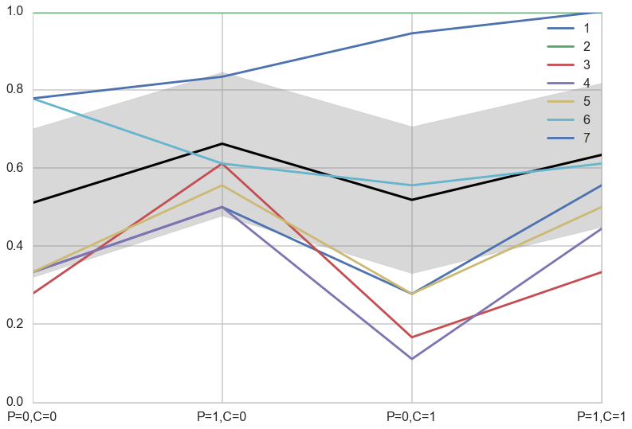


## Ensemble the model


```python
for m in dfc.index:
    print(m)
```


    prosocial left only
    full
    intercept only


```python
modeldict={
    "prosocial left only": trace_plonly,
    "full": trace_full,
    "intercept only": trace_ionly
}
```


```python
def ensemble(grid, modeldict, paramnames, comparedf):
    accum_pp=0
    accum_weight=0
    for m in comparedf.index:
        weight = comparedf.ix[m]['weight']
        pp=compute_pp(grid, modeldict[m], paramnames, like_sample, invlogit, model_pp)
        print(m, weight, np.median(pp))
        accum_pp += pp*weight
        accum_weight +=weight
    return accum_pp/accum_weight
```


```python
ppens = ensemble(xgrid, modeldict, ['alpha', 'betap', 'betapc'], dfc)
```


    dict_keys(['betapc', 'betap', 'alpha'])
    prosocial left only 0.684034358902 4.0
    dict_keys(['betapc', 'betap', 'alpha'])
    full 0.297565832533 4.0
    dict_keys(['betapc', 'betap', 'alpha'])
    intercept only 0.0183998085648 4.0


```python
meanpp, stdpp = ppens.mean(axis=1), ppens.std(axis=1)
fmt = lambda d: ",".join([e+"="+str(d[e]) for e in d])
plt.plot(range(4),meanpp/ppdivisor, lw=3, color="black")
for i, chimp in enumerate(gd):
    plt.plot(range(4), gd[chimp], label="actor {}".format(chimp), lw=3)
plt.fill_between(range(4), (meanpp-stdpp)/ppdivisor, (meanpp+stdpp)/ppdivisor, alpha=0.4, color="gray")
plt.ylim([0,1.1])
plt.xticks(range(4),[fmt(e) for e in xgrid])
plt.legend();
```


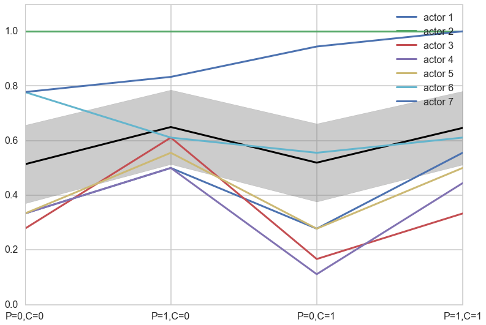


## A heirarchical model

Here we have a varying intercepts model


```python
def vi_model():
    with pm.Model() as vi:
        betapc = pm.Normal("betapc", 0, 10)
        betap = pm.Normal("betap", 0, 10)
        alpha = pm.Normal('alpha', 0, 10)
        sigma_actor = pm.HalfCauchy("sigma_actor", 1)
        alpha_actor = pm.Normal('alpha_actor', 0, sigma_actor, shape=7)
        logitpi = alpha + alpha_actor[df.index//72] + (betap + betapc*df.condition)*df.prosoc_left
        o = pm.Bernoulli("pulled_left", p=pm.math.invlogit(logitpi), observed=df.pulled_left)
        
    return vi
```


```python
vi = vi_model()
with vi:
    vi_trace=pm.sample(10000)
```


    Average ELBO = -287.67:  26%|██▌       | 51979/200000 [00:15<00:39, 3776.80it/s]47, 1866.31it/s]
    100%|██████████| 10000/10000 [01:07<00:00, 147.13it/s]


```python
pm.traceplot(vi_trace);
```


```python
pm.autocorrplot(vi_trace);
```


```python
pm.plot_posterior(vi_trace, kde_plot=True);
```


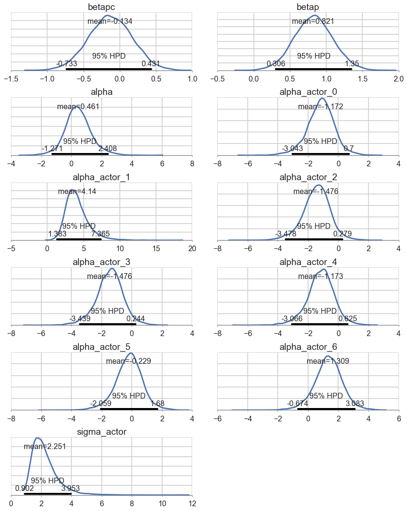


```python
pm.forestplot(vi_trace);
```


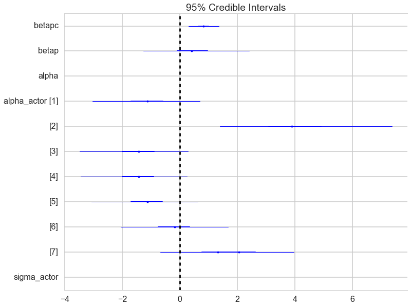


```python
trace.varnames
```


    ['betapc', 'betap', 'alpha', 'sigma_actor_log_', 'alpha_actor', 'sigma_actor']


```python
np.exp(0.2)
```


    1.2214027581601699


### Predictives are on individuals now


```python
def like_sample_hier(p_array):
    return bernoulli.rvs(p=p_array)
```


```python
def model_pp_hier(gridx, tracedict, ix):
    temp = tracedict['alpha'] + tracedict['alpha_actor'][:,ix]+gridx['P']*(tracedict['betap'] + tracedict['betapc']*gridx['C'])
    return temp
```


```python
def compute_pp2(lpgrid, trace, paramnames, sampdistrib, invlink, inner_pp, ix):
    tdict=trace
    tl=len(trace)
    gl=len(lpgrid)
    pp = np.empty((gl, tl))
    for i, v in enumerate(lpgrid):
        temp = inner_pp(lpgrid[i], tdict, ix)
        pp[i,:] = invlink(temp)
    return pp
```


```python
vi_trace.varnames
```


    ['betapc', 'betap', 'alpha', 'sigma_actor_log_', 'alpha_actor', 'sigma_actor']


```python
vnames=['betapc', 'betap', 'alpha', 'alpha_actor']
pphier0=compute_pp2(xgrid, vi_trace, vnames, like_sample_hier, invlogit, model_pp_hier, 0)
```


```python
ppdivisor=1
meanpp, stdpp = pphier0.mean(axis=1), pphier0.std(axis=1)
fmt = lambda d: ",".join([e+"="+str(d[e]) for e in d])
plt.plot(range(4),meanpp/ppdivisor, lw=3, color="black")
plt.plot(range(4), gd[1], label="actor{}".format(1), lw=3)
plt.fill_between(range(4), (meanpp-stdpp)/ppdivisor, (meanpp+stdpp)/ppdivisor, alpha=0.4, color="gray")
plt.ylim([0,1.1])
plt.xticks(range(4),[fmt(e) for e in xgrid])
plt.legend();
```


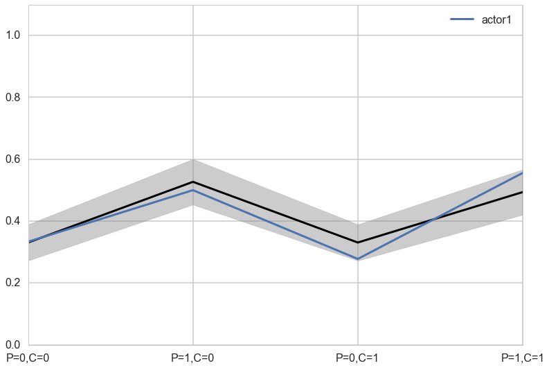


```python
pphier6=compute_pp2(xgrid, vi_trace, vnames, like_sample_hier, invlogit, model_pp_hier, 6)
```


```python
ppdivisor=1
meanpp, stdpp = pphier6.mean(axis=1), pphier6.std(axis=1)
fmt = lambda d: ",".join([e+"="+str(d[e]) for e in d])
plt.plot(range(4),meanpp/ppdivisor, lw=3, color="black")
plt.plot(range(4), gd[7], label="actor{}".format(7), lw=3)
plt.fill_between(range(4), (meanpp-stdpp)/ppdivisor, (meanpp+stdpp)/ppdivisor, alpha=0.4, color="gray")
plt.ylim([0,1.1])
plt.xticks(range(4),[fmt(e) for e in xgrid])
plt.legend();
```


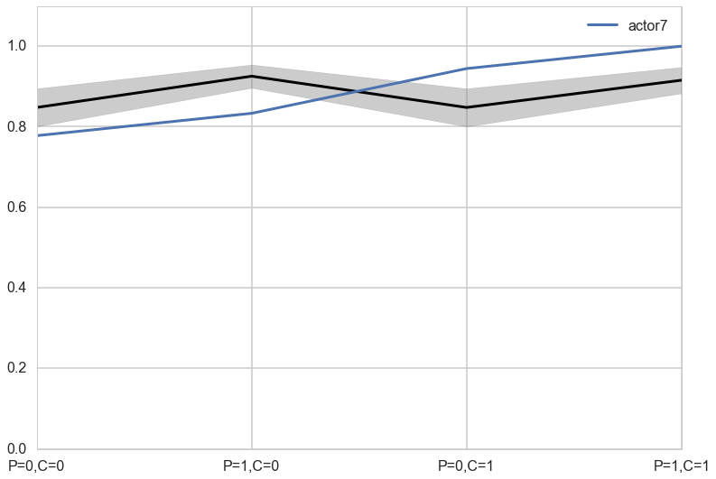


## Varying experimental blocks as well

>The kind of data structure here is usually called a CROSS-CLASSIFIED multilevel model. It is cross-classified, because actors are not nested within unique blocks. If each chimpanzee had instead done all of his or her pulls on a single day, within a single block, then the data structure would instead be hierarchical. However, the model specification would typically be the same. So the model structure and code you'll see below will apply both to cross-classified designs and hierarchical designs. Other software sometimes forces you to treat these differently, on account of using a conditioning engine substantially less capable than MCMC. There are other types of “hierarchical” multilevel models, types that make adaptive priors for adaptive priors. It's turtles all the way down, recall (page 13). You'll see an example in the next chapter. But for the most part, people (or their software) nearly always use the same kind of model in both cases. (McElreath 371)

>Each pull is within a cluster of pulls belonging to an individual chimpanzee. But each pull is also within an experimental block, which represents a collection of observations that happened on the same day. So each observed pull belongs to both an actor (1 to 7) and a block (1 to 6). There may be unique intercepts for each actor as well as for each block. (McElreath 370-371)


```python
df.head(50)
```


<div>
<table border="1" class="dataframe">
  <thead>
    <tr style="text-align: right;">
      <th></th>
      <th>actor</th>
      <th>recipient</th>
      <th>condition</th>
      <th>block</th>
      <th>trial</th>
      <th>prosoc_left</th>
      <th>chose_prosoc</th>
      <th>pulled_left</th>
    </tr>
  </thead>
  <tbody>
    <tr>
      <th>0</th>
      <td>1</td>
      <td>0</td>
      <td>0</td>
      <td>1</td>
      <td>2</td>
      <td>0</td>
      <td>1</td>
      <td>0</td>
    </tr>
    <tr>
      <th>1</th>
      <td>1</td>
      <td>0</td>
      <td>0</td>
      <td>1</td>
      <td>4</td>
      <td>0</td>
      <td>0</td>
      <td>1</td>
    </tr>
    <tr>
      <th>2</th>
      <td>1</td>
      <td>0</td>
      <td>0</td>
      <td>1</td>
      <td>6</td>
      <td>1</td>
      <td>0</td>
      <td>0</td>
    </tr>
    <tr>
      <th>3</th>
      <td>1</td>
      <td>0</td>
      <td>0</td>
      <td>1</td>
      <td>8</td>
      <td>0</td>
      <td>1</td>
      <td>0</td>
    </tr>
    <tr>
      <th>4</th>
      <td>1</td>
      <td>0</td>
      <td>0</td>
      <td>1</td>
      <td>10</td>
      <td>1</td>
      <td>1</td>
      <td>1</td>
    </tr>
    <tr>
      <th>5</th>
      <td>1</td>
      <td>0</td>
      <td>0</td>
      <td>1</td>
      <td>12</td>
      <td>1</td>
      <td>1</td>
      <td>1</td>
    </tr>
    <tr>
      <th>6</th>
      <td>1</td>
      <td>0</td>
      <td>0</td>
      <td>2</td>
      <td>14</td>
      <td>1</td>
      <td>0</td>
      <td>0</td>
    </tr>
    <tr>
      <th>7</th>
      <td>1</td>
      <td>0</td>
      <td>0</td>
      <td>2</td>
      <td>16</td>
      <td>1</td>
      <td>0</td>
      <td>0</td>
    </tr>
    <tr>
      <th>8</th>
      <td>1</td>
      <td>0</td>
      <td>0</td>
      <td>2</td>
      <td>18</td>
      <td>0</td>
      <td>1</td>
      <td>0</td>
    </tr>
    <tr>
      <th>9</th>
      <td>1</td>
      <td>0</td>
      <td>0</td>
      <td>2</td>
      <td>20</td>
      <td>0</td>
      <td>1</td>
      <td>0</td>
    </tr>
    <tr>
      <th>10</th>
      <td>1</td>
      <td>0</td>
      <td>0</td>
      <td>2</td>
      <td>22</td>
      <td>0</td>
      <td>0</td>
      <td>1</td>
    </tr>
    <tr>
      <th>11</th>
      <td>1</td>
      <td>0</td>
      <td>0</td>
      <td>2</td>
      <td>24</td>
      <td>1</td>
      <td>0</td>
      <td>0</td>
    </tr>
    <tr>
      <th>12</th>
      <td>1</td>
      <td>0</td>
      <td>0</td>
      <td>3</td>
      <td>26</td>
      <td>0</td>
      <td>0</td>
      <td>1</td>
    </tr>
    <tr>
      <th>13</th>
      <td>1</td>
      <td>0</td>
      <td>0</td>
      <td>3</td>
      <td>28</td>
      <td>1</td>
      <td>1</td>
      <td>1</td>
    </tr>
    <tr>
      <th>14</th>
      <td>1</td>
      <td>0</td>
      <td>0</td>
      <td>3</td>
      <td>30</td>
      <td>0</td>
      <td>1</td>
      <td>0</td>
    </tr>
    <tr>
      <th>15</th>
      <td>1</td>
      <td>0</td>
      <td>0</td>
      <td>3</td>
      <td>32</td>
      <td>1</td>
      <td>1</td>
      <td>1</td>
    </tr>
    <tr>
      <th>16</th>
      <td>1</td>
      <td>0</td>
      <td>0</td>
      <td>3</td>
      <td>34</td>
      <td>1</td>
      <td>0</td>
      <td>0</td>
    </tr>
    <tr>
      <th>17</th>
      <td>1</td>
      <td>0</td>
      <td>0</td>
      <td>3</td>
      <td>36</td>
      <td>0</td>
      <td>1</td>
      <td>0</td>
    </tr>
    <tr>
      <th>18</th>
      <td>1</td>
      <td>0</td>
      <td>0</td>
      <td>4</td>
      <td>38</td>
      <td>1</td>
      <td>1</td>
      <td>1</td>
    </tr>
    <tr>
      <th>19</th>
      <td>1</td>
      <td>0</td>
      <td>0</td>
      <td>4</td>
      <td>40</td>
      <td>0</td>
      <td>0</td>
      <td>1</td>
    </tr>
    <tr>
      <th>20</th>
      <td>1</td>
      <td>0</td>
      <td>0</td>
      <td>4</td>
      <td>42</td>
      <td>0</td>
      <td>0</td>
      <td>1</td>
    </tr>
    <tr>
      <th>21</th>
      <td>1</td>
      <td>0</td>
      <td>0</td>
      <td>4</td>
      <td>44</td>
      <td>0</td>
      <td>1</td>
      <td>0</td>
    </tr>
    <tr>
      <th>22</th>
      <td>1</td>
      <td>0</td>
      <td>0</td>
      <td>4</td>
      <td>46</td>
      <td>1</td>
      <td>1</td>
      <td>1</td>
    </tr>
    <tr>
      <th>23</th>
      <td>1</td>
      <td>0</td>
      <td>0</td>
      <td>4</td>
      <td>48</td>
      <td>1</td>
      <td>0</td>
      <td>0</td>
    </tr>
    <tr>
      <th>24</th>
      <td>1</td>
      <td>0</td>
      <td>0</td>
      <td>5</td>
      <td>50</td>
      <td>0</td>
      <td>1</td>
      <td>0</td>
    </tr>
    <tr>
      <th>25</th>
      <td>1</td>
      <td>0</td>
      <td>0</td>
      <td>5</td>
      <td>52</td>
      <td>0</td>
      <td>0</td>
      <td>1</td>
    </tr>
    <tr>
      <th>26</th>
      <td>1</td>
      <td>0</td>
      <td>0</td>
      <td>5</td>
      <td>54</td>
      <td>1</td>
      <td>0</td>
      <td>0</td>
    </tr>
    <tr>
      <th>27</th>
      <td>1</td>
      <td>0</td>
      <td>0</td>
      <td>5</td>
      <td>56</td>
      <td>1</td>
      <td>0</td>
      <td>0</td>
    </tr>
    <tr>
      <th>28</th>
      <td>1</td>
      <td>0</td>
      <td>0</td>
      <td>5</td>
      <td>58</td>
      <td>0</td>
      <td>1</td>
      <td>0</td>
    </tr>
    <tr>
      <th>29</th>
      <td>1</td>
      <td>0</td>
      <td>0</td>
      <td>5</td>
      <td>60</td>
      <td>1</td>
      <td>0</td>
      <td>0</td>
    </tr>
    <tr>
      <th>30</th>
      <td>1</td>
      <td>0</td>
      <td>0</td>
      <td>6</td>
      <td>62</td>
      <td>0</td>
      <td>1</td>
      <td>0</td>
    </tr>
    <tr>
      <th>31</th>
      <td>1</td>
      <td>0</td>
      <td>0</td>
      <td>6</td>
      <td>64</td>
      <td>1</td>
      <td>1</td>
      <td>1</td>
    </tr>
    <tr>
      <th>32</th>
      <td>1</td>
      <td>0</td>
      <td>0</td>
      <td>6</td>
      <td>66</td>
      <td>1</td>
      <td>1</td>
      <td>1</td>
    </tr>
    <tr>
      <th>33</th>
      <td>1</td>
      <td>0</td>
      <td>0</td>
      <td>6</td>
      <td>68</td>
      <td>1</td>
      <td>1</td>
      <td>1</td>
    </tr>
    <tr>
      <th>34</th>
      <td>1</td>
      <td>0</td>
      <td>0</td>
      <td>6</td>
      <td>70</td>
      <td>0</td>
      <td>1</td>
      <td>0</td>
    </tr>
    <tr>
      <th>35</th>
      <td>1</td>
      <td>0</td>
      <td>0</td>
      <td>6</td>
      <td>72</td>
      <td>0</td>
      <td>1</td>
      <td>0</td>
    </tr>
    <tr>
      <th>36</th>
      <td>1</td>
      <td>8</td>
      <td>1</td>
      <td>1</td>
      <td>1</td>
      <td>0</td>
      <td>0</td>
      <td>1</td>
    </tr>
    <tr>
      <th>37</th>
      <td>1</td>
      <td>4</td>
      <td>1</td>
      <td>1</td>
      <td>3</td>
      <td>0</td>
      <td>1</td>
      <td>0</td>
    </tr>
    <tr>
      <th>38</th>
      <td>1</td>
      <td>5</td>
      <td>1</td>
      <td>1</td>
      <td>5</td>
      <td>1</td>
      <td>0</td>
      <td>0</td>
    </tr>
    <tr>
      <th>39</th>
      <td>1</td>
      <td>7</td>
      <td>1</td>
      <td>1</td>
      <td>7</td>
      <td>0</td>
      <td>1</td>
      <td>0</td>
    </tr>
    <tr>
      <th>40</th>
      <td>1</td>
      <td>3</td>
      <td>1</td>
      <td>1</td>
      <td>9</td>
      <td>0</td>
      <td>0</td>
      <td>1</td>
    </tr>
    <tr>
      <th>41</th>
      <td>1</td>
      <td>6</td>
      <td>1</td>
      <td>1</td>
      <td>11</td>
      <td>0</td>
      <td>1</td>
      <td>0</td>
    </tr>
    <tr>
      <th>42</th>
      <td>1</td>
      <td>4</td>
      <td>1</td>
      <td>2</td>
      <td>13</td>
      <td>1</td>
      <td>0</td>
      <td>0</td>
    </tr>
    <tr>
      <th>43</th>
      <td>1</td>
      <td>3</td>
      <td>1</td>
      <td>2</td>
      <td>15</td>
      <td>0</td>
      <td>1</td>
      <td>0</td>
    </tr>
    <tr>
      <th>44</th>
      <td>1</td>
      <td>5</td>
      <td>1</td>
      <td>2</td>
      <td>17</td>
      <td>1</td>
      <td>0</td>
      <td>0</td>
    </tr>
    <tr>
      <th>45</th>
      <td>1</td>
      <td>7</td>
      <td>1</td>
      <td>2</td>
      <td>19</td>
      <td>0</td>
      <td>0</td>
      <td>1</td>
    </tr>
    <tr>
      <th>46</th>
      <td>1</td>
      <td>8</td>
      <td>1</td>
      <td>2</td>
      <td>21</td>
      <td>1</td>
      <td>1</td>
      <td>1</td>
    </tr>
    <tr>
      <th>47</th>
      <td>1</td>
      <td>6</td>
      <td>1</td>
      <td>2</td>
      <td>23</td>
      <td>0</td>
      <td>0</td>
      <td>1</td>
    </tr>
    <tr>
      <th>48</th>
      <td>1</td>
      <td>3</td>
      <td>1</td>
      <td>3</td>
      <td>25</td>
      <td>1</td>
      <td>0</td>
      <td>0</td>
    </tr>
    <tr>
      <th>49</th>
      <td>1</td>
      <td>6</td>
      <td>1</td>
      <td>3</td>
      <td>27</td>
      <td>0</td>
      <td>1</td>
      <td>0</td>
    </tr>
  </tbody>
</table>
</div>


```python
def viplusblock_model():
    with pm.Model() as vipb:
        betapc = pm.Normal("betapc", 0, 10)
        betap = pm.Normal("betap", 0, 10)
        alpha = pm.Normal('alpha', 0, 10)
        sigma_actor = pm.HalfCauchy("sigma_actor", 1)
        sigma_block = pm.HalfCauchy("sigma_block", 1)
        alpha_actor = pm.Normal('alpha_actor', 0, sigma_actor, shape=7)
        alpha_block = pm.Normal('alpha_block', 0, sigma_block, shape=6)
        logitpi = alpha + alpha_actor[df.index//72] + alpha_block[df.block.values -1]+ (betap + betapc*df.condition)*df.prosoc_left
        o = pm.Bernoulli("pulled_left", p=pm.math.invlogit(logitpi), observed=df.pulled_left)
        
    return vipb
```


```python
vipb=viplusblock_model()
with vipb:
    trace_vipb = pm.sample(5000)
```


    Average ELBO = -290.43: 100%|██████████| 200000/200000 [01:02<00:00, 3217.45it/s]3, 3135.76it/s]
    100%|██████████| 5000/5000 [00:48<00:00, 104.05it/s]


```python
pm.autocorrplot(trace_vipb);
```


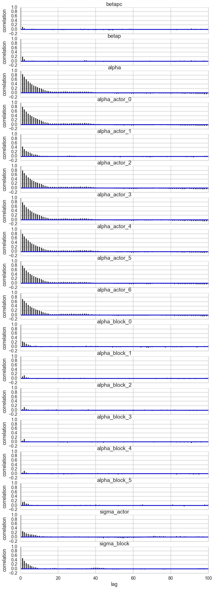


```python
pm.traceplot(trace_vipb);
```


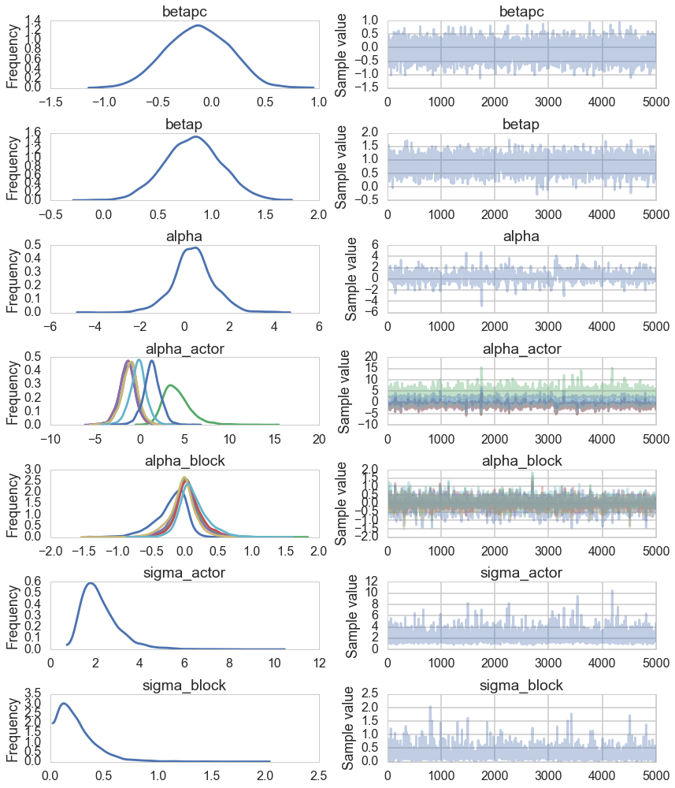


```python
plt.hist(trace_vipb['alpha_block'][:,5], bins=30)
```


    (array([   2.,    1.,    3.,    5.,    6.,   17.,   42.,   94.,  224.,
             539.,  980.,  944.,  719.,  478.,  335.,  222.,  147.,  106.,
              49.,   34.,   16.,   14.,    7.,    5.,    3.,    3.,    2.,
               0.,    2.,    1.]),
     array([-0.86028297, -0.77784083, -0.69539868, -0.61295653, -0.53051439,
            -0.44807224, -0.3656301 , -0.28318795, -0.20074581, -0.11830366,
            -0.03586152,  0.04658063,  0.12902277,  0.21146492,  0.29390706,
             0.37634921,  0.45879135,  0.5412335 ,  0.62367564,  0.70611779,
             0.78855993,  0.87100208,  0.95344423,  1.03588637,  1.11832852,
             1.20077066,  1.28321281,  1.36565495,  1.4480971 ,  1.53053924,
             1.61298139]),
     <a list of 30 Patch objects>)


```python
sns.distplot(trace_vipb['sigma_block'])
sns.distplot(trace_vipb['sigma_actor']);
plt.xlim([-1,10])
```


    //anaconda/envs/py35/lib/python3.5/site-packages/statsmodels/nonparametric/kdetools.py:20: VisibleDeprecationWarning: using a non-integer number instead of an integer will result in an error in the future
      y = X[:m/2+1] + np.r_[0,X[m/2+1:],0]*1j


    (-1, 10)


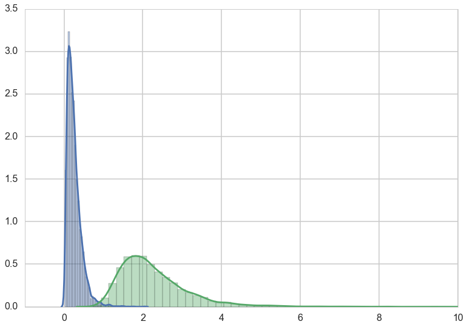


```python
pm.forestplot(trace_vipb);
```


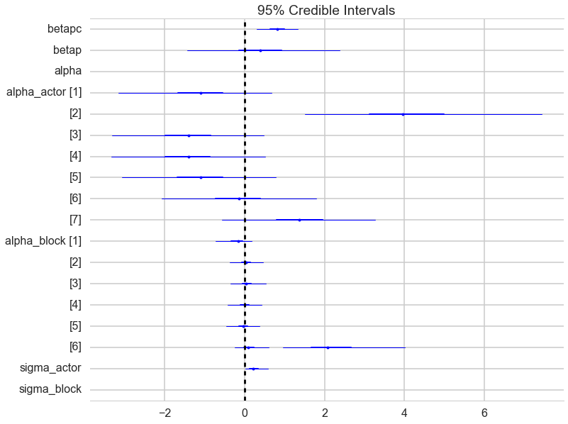


Do this and compare the WAICs.


```python
dfc2=pm.compare([vi_trace, trace_vipb],[vi, vipb])
```


```python
dfc2
```


<div>
<table border="1" class="dataframe">
  <thead>
    <tr style="text-align: right;">
      <th></th>
      <th>WAIC</th>
      <th>pWAIC</th>
      <th>dWAIC</th>
      <th>weight</th>
      <th>SE</th>
      <th>dSE</th>
      <th>warning</th>
    </tr>
  </thead>
  <tbody>
    <tr>
      <th>0</th>
      <td>531.538</td>
      <td>8.19199</td>
      <td>0</td>
      <td>0.623301</td>
      <td>19.5076</td>
      <td>0</td>
      <td>0</td>
    </tr>
    <tr>
      <th>1</th>
      <td>532.545</td>
      <td>10.533</td>
      <td>1.00717</td>
      <td>0.376699</td>
      <td>19.6731</td>
      <td>0.183432</td>
      <td>0</td>
    </tr>
  </tbody>
</table>
</div>


```python
compare_plot(dfc2)
```


    <matplotlib.axes._subplots.AxesSubplot at 0x122ef26a0>


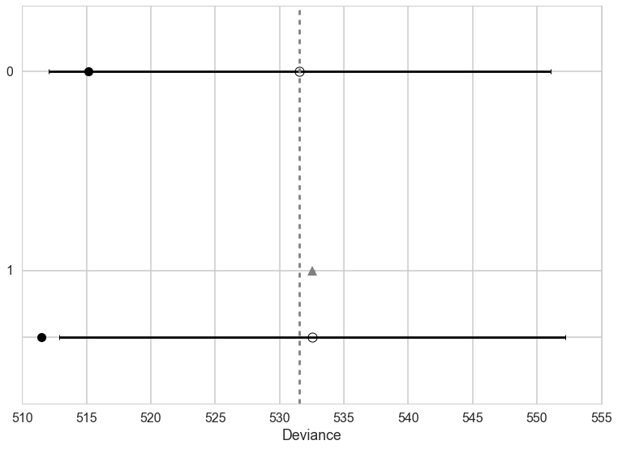


```python

```

